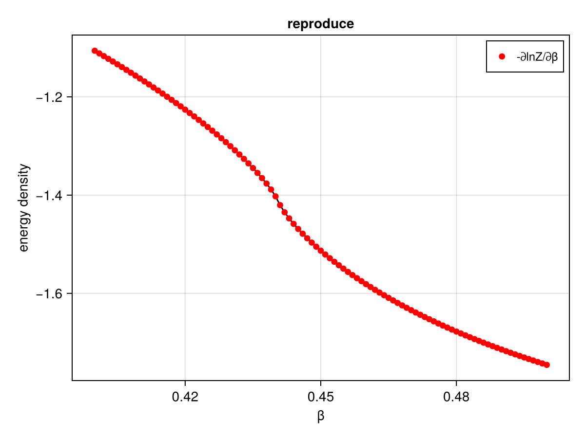
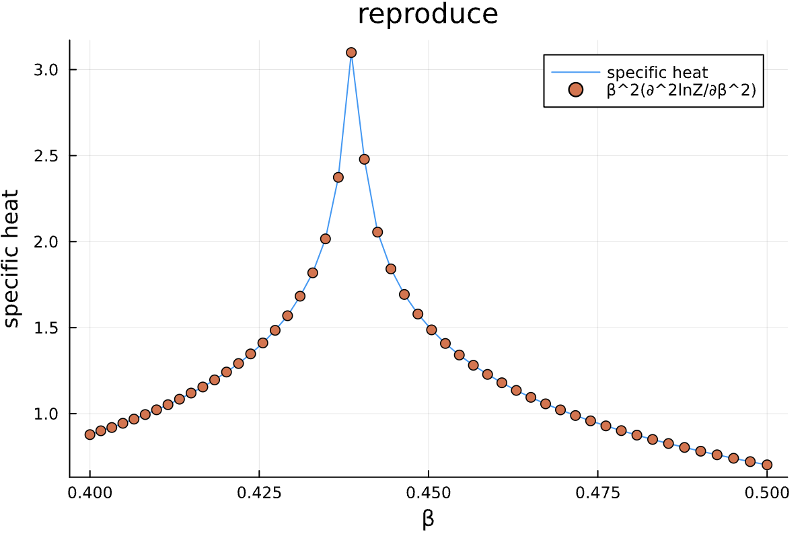

# TensorNetworkAD2

## Introduction
Huanhai and I try to reproduce the results of the paper [Liao, H., Liu, J., Wang, L., Xiang, T., 2019. Differentiable Programming Tensor Networks. Physical Review X 9, 31041]  in Julia.

## Tensor renormalization group (TRG)
The tensor renormalization group or TRG algorithm is a strategy for evaluating a fully contracted network of tensors. The strategy is to factorize each tensor in the network using a truncated singular value decomposition (SVD) into two smaller factor tensors. Then each factor tensor is contracted with another factor from a neighboring tensor, resulting in a new contracted lattice of half as many tensors.

The term “renormalization group” is a term used in the physics literature to refer to processes where less important information at small distance scales is repeatedly discarded until only the most important information remains.

TRG can be used to compute certain large, non-trivial sums by exploiting the fact that they can be recast as the contraction of a lattice of small tensors.
A classic example of such a sum is the “partition function” Z of the classical Ising model at temperature T, defined to be:

$$Z=\sum_{\sigma_1\sigma_2\sigma_3\ldots}e^{-E(\sigma_1,\sigma_2,\sigma_3,\ldots)/T}$$

where each Ising "spin" $\sigma$ is just a variable taking the values +1,-1 and the energy $E(\sigma_1,\sigma_2,\sigma_3,\ldots)$ is the sum of products $\sigma_i\sigma_j$ of neighboring $\sigma$ variables.

In one dimension, spins only have two neighbors since they are arranged along a chain. For a finite-size system of N Ising spins, the usual convention is to use periodic boundary conditions meaning that the Nth spin connects back to the first around a circle:

$$E(\sigma_1,\sigma_2,\sigma_3,\ldots,\sigma_N)=\sigma_1\sigma_2+\sigma_2\sigma_3+\sigma_3\sigma_4+\ldots+\sigma_N\sigma_1$$

The classic “transfer matrix” trick for computing Z goes as follows:
$$Z=\sum_\sigma\exp\left(\frac{-1}T\sum_n\sigma_n\sigma_{n+1}\right)=\sum_\sigma\prod_ne^{-(\sigma_n\sigma_{n+1})/T}=\mathrm{Tr}\left(M^N\right)$$

the transfer matrix M Is a 2x2 matrix with elements:
$$M_{\sigma\sigma^{\prime}}=e^{-(\sigma\sigma^{\prime})/T}.$$

We can view $Tr(M^N)$ as a chain of tensor contractions around a circle: 

With each 2-index tensor in the above diagram defined to equal the matrix M, it is an exact rewriting of the partition function Z as a tensor network.

Now let us consider the main problem of interest. For two dimensions, the energy function can be written as:
$$E(\sigma_1,\sigma_2,\ldots)=\sum_{\langle ij\rangle}\sigma_i\sigma_j$$

Where the notation <$ij$> means the sum only includes i, j which are neighboring sites. It helps to visualize the system:

The blue lines represent the local energies $\sigma_i\sigma_j$, the total energy E of each configuration is the sum of all of these local energies.Interestingly, it is again possible to rewrite the partition function sum Z as a network of contracted tensors. Define the tensor to be:
$$A^{\sigma_t\sigma_r\sigma_b\sigma_l} = e^{-(\sigma_t\sigma_r+\sigma_r\sigma_b+\sigma_b\sigma_l+\sigma_l\sigma_t)/T}$$

The interpretation of this tensor is that it computes the local energies between the four spins that live on its indices, and its value is the Boltzmann probability weight $e^{-E/T}$, associated with these energies. Note its similarity to the one-dimensional transfer matrix M.

    

With A defined, the partition function Z for the two-dimensional Ising model can be found by contracting the following network of A tensors:

    

The above drawing is of a lattice of 32 Ising spins (recall that the spins live on the tensor indices). The indices at the edges of this square wrap around in a periodic fashion because the energy function was defined using periodic boundary conditions.

TRG is a strategy for computing the above 2d network, which is just equal to a single number Z (since there are no uncontracted external indices). The TRG approach is to locally replace individual A tensors with pairs of lower-rank tensors which guarantee the result of the contraction remains the same to a good approximation. These smaller tensors can then be recombined in a different way that results in a more sparse, yet equivalent network.

Both factorizations can be computed using the singular value decomposition (SVD). For example, to compute the first factorization, view $A_0$ as a matrix with a collective “row” index $\sigma_l$ and $\sigma_t$ and collective “column” index $\sigma_r$ and $\sigma_b$. After performing an SVD of $A_0$ in this way, further factorize the singular value matrix $S$ as $S=\sqrt{S}\sqrt{S}$ and absorb each factor into U and V to create the factors $F_1,F_2$.

Importantly, the SVD is only done approximately by retaining just the  largest singular values and discarding the columns of U and V corresponding to the smaller singular values. This truncation is crucial for keeping the cost of the TRG algorithm under control. Making the above substitutions, either $A_0=F_1F_3,A_0=F_2F_4$ , on alternating lattice sites, transforms the original tensor network into the following network:

Finally by contracting the four F tensors in the following way:

    

$A_1$ which has four indices just like $A_0$, contracting the $A_1$ tensors in a square-lattice pattern gives the same result (up to SVD truncation errors) as contracting the original $A_0$ tensors, only there are half as many $A_1$ tensors, (each $A_0$ consists of two F’s while each $A_1$ consists of four F’s).

    

To compute Z defined by contracting a square lattice, one repeats the above two steps (factor and recombine) N times until only a single tensor remains. Calling this final tensor $A_N$, the result Z of contracting the original network is equal to the following “double trace”of $A_N$:

    

## Corner transfer matrix renormalization group (CTMRG)
Gradient based optimization methods are the established state-of-the-art paradigm to study strongly entangled quantum systems in two dimensions with Projected Entangled Pair States. However, the key ingredient, the gradient itself, has proven challenging to calculate accurately and reliably in the case of a corner transfer matrix based approach.

Tensor Network methods are designed specifically to deal with many body systems and have already proven very useful in the studies of strongly entangled states. One of their early successes was the discovery of the density matrix renormalization group (DMRG) algorithm and an independently developed matrix product state (MPS) ansatz  that proved strikingly effective for studying one dimensional gapped spin systems. The two-dimensional extension of these ideas are projected entangled pair states (PEPS).

A key cause for the difficulty in using PEPS is that unlike for MPS, calculation of local observables cannot be done exactly, but require some form of approximate contraction of the tensor network. The easiest to implement and most commonly used of these schemes is the CTM. Optimizing PEPS for the ground state has been done in a multitude of ways.

Matrix Product States (MPS) is a special form of tensor network, which is widely used to represent the wave function of 1D quantum many body systems，consider a 1D chain with N sites. We can see that:

For a 2D quantum many body system, we can use the Projected Entangled Pair States(peps) to represent the wave function, consider a 2D lattice with N sites. We can see that:

    

We consider an infinite projected entangled pair state (iPEPS) as the variational ansatz. The variational parameters are the elements in the iPEPS. Where s denotes the physical indices, and the remaining indices u, l, d, r are for virtual degrees of freedom of the bond dimension D. 

A state $|Ψ(A)⟩$ in (B) in generated by a single PEPS tensor in (A) by contracting its virtual indices.

Consider 2 higher-order tensors $T^{s1,s2,s3,s4,s5,s6}$ and $W^{s1, s2, s3, s4, s5, s6}$, say that we want to compute the inner product of $T$ and $W$, if $W$=$T$this operation computes the norm of $T$. We want to compute:

    

    

    

    

A double PEPS tensors in (C) is formed by contracting the PEPS tensor A and its conjugate via physical index and grouping the remaining open indices. We consider a variational study of the square lattice antifer- romagnetic Heisenberg model, and we want to find the ground state, minimize the expect energy: $\langle\psi|H|\psi\rangle/\langle\psi|\psi\rangle$.

In order to calculate a local observable one needs to approximate an infinite double-layer PEPS tensors network around the PEPS tensors where the operator acts with a finite environment formed by corner tensors C and the edge tensors T.

We can represent an infinite 2D square lattice with tensorsnetworks, consist of many many bulk tensors. We can see that:

We can define the edge tensors as a special combination of the bulk tensors, and we can see that:

    

We can also define the corner tensors as a special combination of the bulk tensors, and we can see that:

    

We want to solve this self-consistent equation iteratively:

    

For the corner tensors and edge tensors iteration, we can see that:

1. Contract the bulk tensor with the corner and edge tensors to form a 4-leg tensor.
2. Perform truncated SVD to the 4-leg tensor, keeping the singular dimensions up to the cut off , Keep the truncated singular matrix as the isometric projector.
3. Apply the isometry to the 4-leg tensor from the first step to find a new corner tensor
4. Apply the same isometry to find a new edge tensor for the next step. And iterate this procedure until convergence.One sees that the same bulk tensor with bond dimension d appears in each step of the CTMRG iteration. Due to this reason, the converged environment tensors will depend on the bulk tensor in a complicated way.

## Results
Results are shown below:

    

    

