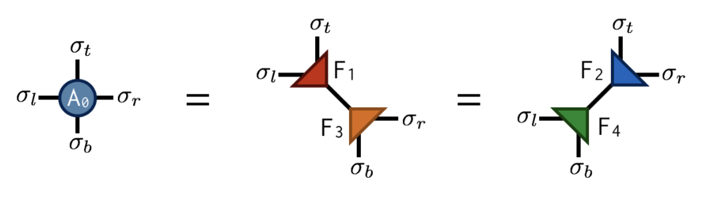

## TRG Algorithm

### Background
The tensor renormalization group or TRG algorithm is a strategy for evaluating a fully contracted network of tensors. The strategy is to factorize each tensor in the network using a truncated singular value decomposition (SVD) into two smaller factor tensors. Then each factor tensor is contracted with another factor from a neighboring tensor, resulting in a new contracted lattice of half as many tensors.

 The TRG algorithm is a specific example of a renormalization group algorithm that is used to evaluate the partition function of a lattice model.

---

TRG can be used to compute certain large, non-trivial sums by exploiting the fact that they can be recast as the contraction of a lattice of small tensors.
A classic example of such a sum is the “partition function” Z of the classical Ising model at temperature T, defined to be:

$$
Z=\sum_{\sigma_1\sigma_2\sigma_3\ldots}e^{-E(\sigma_1,\sigma_2,\sigma_3,\ldots)/T}
$$

where each Ising "spin" $\sigma$ is just a variable taking the values +1,-1 and the energy $E(\sigma_1,\sigma_2,\sigma_3,\ldots)$ is the sum of products $\sigma_i\sigma_j$ of neighboring $\sigma$ variables.

---

In one dimension, spins only have two neighbors since they are arranged along a chain. For a finite-size system of N Ising spins, the usual convention is to use periodic boundary conditions meaning that the Nth spin connects back to the first around a circle:

$$E(\sigma_1,\sigma_2,\sigma_3,\ldots,\sigma_N)=\sigma_1\sigma_2+\sigma_2\sigma_3+\sigma_3\sigma_4+\ldots+\sigma_N\sigma_1$$

---

---

We can view $Tr(M^N)$ as a chain of tensor contractions around a circle:          

With each 2-index tensor in the above diagram defined to equal the matrix M, it is an exact rewriting of the partition function Z as a tensor network.

---

---

Now let us consider the main problem of interest. For two dimensions, the energy function can be written as:
$$
E(\sigma_1,\sigma_2,\ldots)=\sum_{\langle ij\rangle}\sigma_i\sigma_j
$$

Where the notation <i, j> means the sum only includes i, j which are neighboring sites. It helps to visualize the system:

---

The blue lines represent the local energies $\sigma_i\sigma_j$ , the total energy E of each configuration is the sum of all of these local energies.Interestingly, it is again possible to rewrite the partition function sum Z as a network of contracted tensors. Define the tensor to be:
$$
A^{\sigma_t\sigma_r\sigma_b\sigma_l} = e^{-(\sigma_t\sigma_r+\sigma_r\sigma_b+\sigma_b\sigma_l+\sigma_l\sigma_t)/T}
$$

The interpretation of this tensor is that it computes the local energies between the four spins that live on its indices, and its value is the Boltzmann probability weight $e^{-E/T}$, associated with these energies. Note its similarity to the one-dimensional transfer matrix M.

---

---

With A defined, the partition function Z for the two-dimensional Ising model can be found by contracting the following network of A tensors:

---

The above drawing is of a lattice of 32 Ising spins (recall that the spins live on the tensor indices). The indices at the edges of this square wrap around in a periodic fashion because the energy function was defined using periodic boundary conditions.

TRG is a strategy for computing the above 2d network, which is just equal to a single number Z (since there are no uncontracted external indices). The TRG approach is to locally replace individual A tensors with pairs of lower-rank tensors which guarantee the result of the contraction remains the same to a good approximation. These smaller tensors can then be recombined in a different way that results in a more sparse, yet equivalent network.

---

Referring to the original $A$ tensor as $A_0$, the first “move” of TRG is to factorize the $A_0$tensor in two different ways: 

---

Importantly, the SVD is only done approximately by retaining just the  largest singular values and discarding the columns of U and V corresponding to the smaller singular values. This truncation is crucial for keeping the cost of the TRG algorithm under control.
Making the above substitutions, either $A_0=F_1F_3,A_0=F_2F_4$, on alternating lattice sites, transforms the original tensor network into the following network:

---

---

Finally by contracting the four F tensors in the following way:

---

---

---

