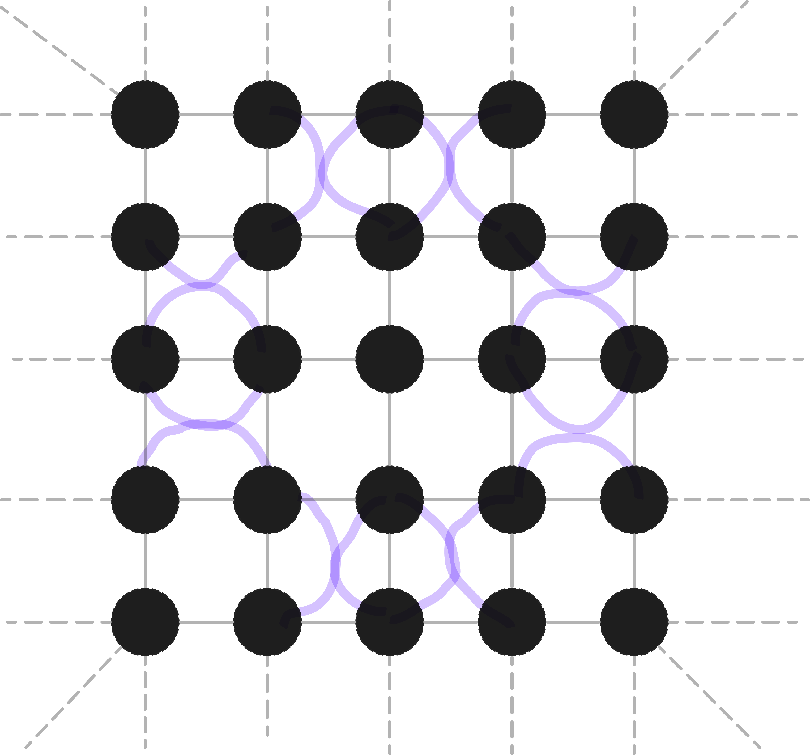

## Coner transfer matrix renormalization group algorithm

---

Matrix Product States (MPS) is a special form of tensor network, which is widely used to represent the wave function of 1D quantum many body systems， consider a 1D chain with N sites. We can see that:

---

For a 2D quantum many body system, we can use the Projected Entangled Pair States(peps) to represent the wave function, consider a 2D lattice with N sites. We can see that:

---

We consider an infinite projected entangled pair state (iPEPS) as the variational ansatz. The variational parameters are the elements in the iPEPS. Where s denotes the physical indices, and the remaining in- dices u, l, d, r are for virtual degrees of freedom of the bond dimension D. 

---

We consider a variational study of the square lattice antifer- romagnetic Heisenberg model with the Hamiltonian：

$$H=\sum_{\langle i,j\rangle}S_i^xS_j^x+S_i^yS_j^y+S_i^zS_j^z$$

---

---

---

---

---

---

---

