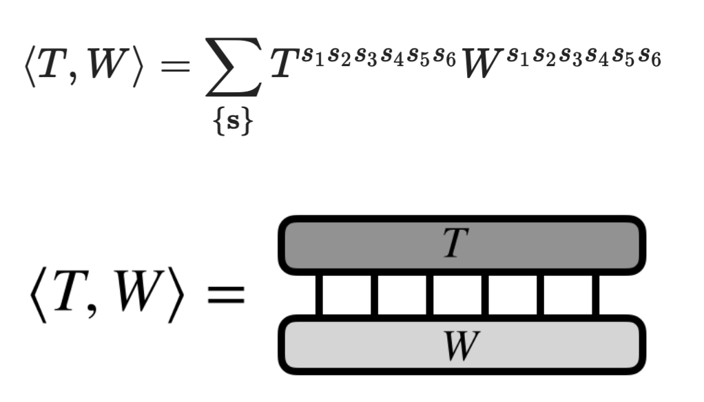

## Coner transfer matrix renormalization group algorithm

---

Matrix Product States (MPS) is a special form of tensor network, which is widely used to represent the wave function of 1D quantum many body systems， consider a 1D chain with N sites. We can see that:

---

For a 2D quantum many body system, we can use the Projected Entangled Pair States(peps) to represent the wave function, consider a 2D lattice with N sites. We can see that:

---

We consider an infinite projected entangled pair state (iPEPS) as the variational ansatz. The variational parameters are the elements in the iPEPS. Where s denotes the physical indices, and the remaining in- dices u, l, d, r are for virtual degrees of freedom of the bond dimension D. 

---

Consider 2 higher-order tensors $T^{s1,s2,s3,s4,s5,s6}$ and $W^{s1, s2, s3, s4, s5, s6}$, say that we want to compute the inner product of $T$ and $W$, if $W$=$T$this operation computes the norm of $T$. We want to compute:

---

We consider a variational study of the square lattice antifer- romagnetic Heisenberg model, and we want to find the ground state, minimize the expect energy: $\langle\psi|H|\psi\rangle/\langle\psi|\psi\rangle$ 

We can see that the overlap of the iPEPS forms a tensor network, where the bulk tensor is the double layer tensor with bond dimension $d = D^2$

---

---

---

We can represent an infinite 2D square lattice with tensorsnetworks, consist of many many bulk tensors. We can see that:

---

We can define the edge tensors as a special combination of the bulk tensors, and we can see that:

---

We can also define the corner tensors as a special combination of the bulk tensors, and we can see that:

---

We want to solve this self-consistent equation iteratively.

---

---

---

---

